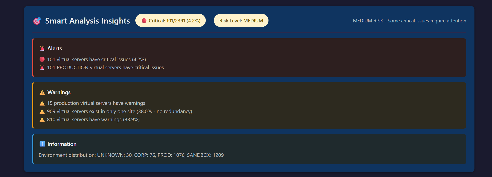

# 🔍 F5 Configuration Comparison System

> Enterprise-grade serverless automation for F5 LTM virtual server comparison across multi-datacenter deployments

[](https://aws.amazon.com/lambda/)
[](https://www.terraform.io/)
[](https://www.python.org/)
[](LICENSE)

**Automated biannual comparison of 2,000+ F5 virtual servers, eliminating 40+ hours of manual work per cycle**

---

## 📋 Table of Contents

- [Overview](#-overview)
- [The Problem](#-the-problem)
- [The Solution](#-the-solution)
- [Key Features](#-key-features)
- [Architecture](#-architecture)
- [Screenshots](#-screenshots)
- [Tech Stack](#-tech-stack)
- [Getting Started](#-getting-started)
- [Configuration](#-configuration)
- [Cost Analysis](#-cost-analysis)
- [Documentation](#-documentation)
- [Contributing](#-contributing)
- [License](#-license)

---

## 🎯 Overview

The F5 Configuration Comparison System is a production-ready serverless solution that automates the comparison of F5 LTM (Local Traffic Manager) virtual server configurations across multiple datacenters. Built with AWS Lambda, Terraform, and intelligent analysis algorithms, it identifies configuration drift, missing redundancy, and critical mismatches with site-aware intelligence.

### Why This Matters

In enterprise environments with thousands of virtual servers distributed across multiple sites, maintaining configuration consistency is critical for:
- **Disaster Recovery Readiness** - Ensuring failover configurations are correct
- **Compliance** - Documenting infrastructure state for audits
- **Risk Management** - Proactively identifying configuration drift
- **Operational Efficiency** - Eliminating manual comparison work

---

## 😰 The Problem

### Manual Configuration Comparison Challenges:

**Before Automation:**
- ⏰ **40+ hours** spent per comparison cycle
- 📋 **2,000+ virtual servers** to compare manually
- 🔍 Line-by-line text comparison prone to human error
- 📊 No intelligent analysis or risk assessment
- 🚫 No automated alerting or documentation
- 💰 High operational cost (engineer time)
- 📅 Only performed biannually due to time constraints

**Pain Points:**
- Comparing configurations across sites required understanding expected differences (site-specific IPs) vs. real issues
- Distinguishing between production, corporate, and sandbox environments
- Tracking historical changes over time
- Generating executive-ready reports

---

## ✅ The Solution

### Intelligent Automated Comparison:

**After Automation:**
- ⚡ **~16 seconds** per comparison run
- 🤖 **100% automated** via AWS Lambda
- 🧠 **Site-aware intelligence** (understands cross-site IP patterns)
- 🎯 **Environment classification** (PROD/CORP/SANDBOX risk scoring)
- 📊 **Interactive HTML reports** with filtering and search
- 💬 **Teams notifications** with rich formatting
- 💾 **Historical tracking** in DynamoDB (90-day retention)
- 📈 **CloudWatch metrics** and alerting
- 💰 **~$25/month** operational cost

---

## 🚀 Key Features

### Intelligent Analysis

- **Site-Aware Comparison**
  - Distinguishes expected cross-site differences (10.x.x.x vs 10.y.y.y) from real issues
  - Identifies same-network mismatches (critical)
  - Ignores cross-site different hosts (expected architecture)

- **Environment-Based Risk Classification**
  - PROD: Critical severity for mismatches
  - CORP/SANDBOX: Warning severity (testing environments)
  - Smart timestamp and metadata filtering

- **Risk Scoring**
  - Critical percentage calculation (e.g., 101/2391 = 4.2%)
  - Risk levels: LOW (<1%), MEDIUM (1-5%), HIGH (>5%)
  - Automated assessment and recommendations

### Automation Features

- **Serverless Architecture**
  - AWS Lambda (Python 3.11)
  - EventBridge scheduling (biannual: Jan 1 & July 1)
  - On-demand execution via AWS CLI

- **Secure SSH Access**
  - Credentials stored in AWS Secrets Manager
  - Paramiko for SFTP file transfer
  - Private VPC with VPC endpoints (no internet gateway)

- **Data Storage & History**
  - S3 for HTML reports (compressed)
  - DynamoDB for metadata (90-day TTL)
  - CloudWatch for metrics and logs

- **Notifications**
  - Microsoft Teams webhook integration
  - Rich adaptive cards with statistics
  - Direct link to detailed reports

### User Experience

- **Interactive HTML Reports**
  - Search functionality
  - Filter by: All, Differences, Critical, Warnings, Matches
  - Dark/Light theme toggle
  - Expandable/collapsible virtual servers
  - Export to JSON

- **Visual Indicators**
  - 🔴 Critical (red badges)
  - ⚠️ Warning (yellow badges)
  - ✅ Match (green badges)
  - Color-coded configuration differences

---

## 🏗️ Architecture

```
┌─────────────────────────────────────────────────────────────────────┐
│                         AWS CLOUD (Region: ${var.aws_region})       │
│                                                                       │
│  ┌──────────────────────────────────────────────────────────────┐  │
│  │                    VPC (Private Subnet)                       │  │
│  │                                                                │  │
│  │  ┌────────────────────────────────────────────────┐          │  │
│  │  │         Lambda Function (Python 3.11)          │          │  │
│  │  │  - F5 Config Comparison                        │          │  │
│  │  │  - Site-Aware Analysis                         │          │  │
│  │  │  - Report Generation                           │          │  │
│  │  └────────────────┬───────────────────────────────┘          │  │
│  │                   │                                            │  │
│  │         ┌─────────┼──────────┬──────────┬──────────┐          │  │
│  │         │         │          │          │          │          │  │
│  │    ┌────▼───┐ ┌──▼───┐ ┌────▼────┐ ┌───▼───┐ ┌───▼───┐     │  │
│  │    │   S3   │ │ Logs │ │ Secrets │ │  SNS  │ │ DDB   │     │  │
│  │    │Endpoint│ │Endpt │ │ Manager │ │Endpt  │ │Endpt  │     │  │
│  │    │        │ │      │ │ Endpoint│ │       │ │       │     │  │
│  │    └────────┘ └──────┘ └─────────┘ └───────┘ └───────┘     │  │
│  │                                                                │  │
│  └──────────────────────────────────────────────────────────────┘  │
│                                                                       │
│  ┌──────────────┐  ┌─────────────┐  ┌──────────────┐              │
│  │      S3      │  │  DynamoDB   │  │    Secrets   │              │
│  │   (Reports)  │  │  (History)  │  │   Manager    │              │
│  │              │  │  90-day TTL │  │  (SSH Keys)  │              │
│  └──────────────┘  └─────────────┘  └──────────────┘              │
│                                                                       │
│  ┌──────────────┐  ┌─────────────┐  ┌──────────────┐              │
│  │  CloudWatch  │  │     SNS     │  │ EventBridge  │              │
│  │ Logs/Metrics │  │  (Alerts)   │  │  (Schedule)  │              │
│  │   Alarms     │  │             │  │  Jan 1 & 7/1 │              │
│  └──────────────┘  └──────────────┘  └──────────────┘              │
│                                                                       │
└───────────────────────────────┬───────────────────────────────────┘
                                │
                    ┌───────────┴───────────┐
                    │   Internet Gateway    │
                    │  (Teams Webhook Only) │
                    └───────────┬───────────┘
                                │
                    ┌───────────▼───────────┐
                    │  Microsoft Teams      │
                    │   (Notifications)     │
                    └───────────────────────┘

┌─────────────────────────────────────────────────────────────────────┐
│                    ON-PREMISES DATACENTERS                            │
│                                                                       │
│   ┌─────────────────┐              ┌─────────────────┐             │
│   │  F5 Site 1      │              │  F5 Site 2      │             │
│   │  (10.x.x.x)     │◄────SSH─────►│  (10.y.y.y)     │             │
│   │  ~1,200 VS      │              │  ~1,200 VS      │             │
│   └─────────────────┘              └─────────────────┘             │
│                                                                       │
└───────────────────────────────────────────────────────────────────────┘
```

### Data Flow

1. **EventBridge** triggers Lambda biannually (Jan 1 & July 1 at scheduled time)
2. **Lambda** retrieves SSH credentials from **Secrets Manager**
3. **Lambda** connects to both F5 servers via SSH/SFTP through **VPC**
4. Downloads `/config/bigip.conf` from each F5 server
5. Parses and masks sensitive data (passwords, certificates)
6. Performs site-aware intelligent comparison
7. Generates interactive HTML report
8. Compresses and uploads to **S3**
9. Stores metadata in **DynamoDB** with 90-day TTL
10. Publishes metrics to **CloudWatch**
11. Sends rich notification to **Microsoft Teams**
12. **CloudWatch Alarms** monitor for high critical counts

---

## 📸 Screenshots

### Dashboard - Statistics Overview

*Real-time statistics: 2,391 virtual servers analyzed, 101 critical issues (4.2%), risk assessment*

### Smart Analysis Insights

*Intelligent alerts, warnings, and environment distribution analysis*

### Interactive Controls

*Search, filter by severity, theme toggle, and export functionality*

### Configuration Comparison - Matches

*Collapsed view of matching configurations with environment tags*

### Configuration Comparison - Critical Issues

*Detailed view of critical mismatches with redundancy warnings*

### Microsoft Teams Notification

*Rich adaptive card with comprehensive statistics and direct report link*

---

## 🛠️ Tech Stack

### Infrastructure & Cloud

| Technology | Purpose |
|------------|---------|
| **AWS Lambda** | Serverless compute (Python 3.11) |
| **Terraform** | Infrastructure as Code (IaC) |
| **AWS VPC** | Private networking with endpoints |
| **VPC Endpoints** | Private access to AWS services (S3, DynamoDB, Secrets Manager, CloudWatch, SNS) |
| **Amazon S3** | Report storage with lifecycle policies |
| **Amazon DynamoDB** | Historical metadata with TTL |
| **AWS Secrets Manager** | Secure SSH credential storage |
| **Amazon CloudWatch** | Logs, metrics, and alarms |
| **Amazon SNS** | Alert notifications |
| **Amazon EventBridge** | Scheduled execution |

### Application & Libraries

| Technology | Purpose |
|------------|---------|
| **Python 3.11** | Lambda runtime |
| **Paramiko** | SSH/SFTP client for F5 access |
| **Boto3** | AWS SDK for Python |
| **HTML/CSS/JavaScript** | Interactive report UI |

### Security Features

- SSH key-based authentication
- Secrets Manager for credential storage
- Private VPC (no internet gateway)
- VPC endpoints for AWS service access
- IAM roles with least-privilege policies
- Sensitive data masking in reports
- Network policies and security groups

---

## 🚀 Getting Started

### Prerequisites

- AWS Account with appropriate permissions
- Terraform >= 1.0
- AWS CLI configured
- F5 LTM servers with SSH access
- SSH key pair for F5 authentication

### Installation

1. **Clone the repository**
   ```bash
   git clone https://github.com/yourusername/F5-Config-Comparison-System.git
   cd F5-Config-Comparison-System
   ```

2. **Configure AWS credentials**
   ```bash
   aws configure
   ```

3. **Create SSH key pair for F5 access**
   ```bash
   ssh-keygen -t rsa -b 4096 -f f5_comparison_key
   # Deploy public key to F5 servers
   ```

4. **Store SSH credentials in Secrets Manager**
   ```bash
   # Create secret JSON
   cat > secret.json <<EOF
   {
     "username": "your_f5_username",
     "private_key": "$(cat f5_comparison_key)"
   }
   EOF

   # Store in AWS Secrets Manager
   aws secretsmanager create-secret \
     --name f5_comparison_secrets \
     --secret-string file://secret.json \
     --region ${var.aws_region}

   # Clean up local secret file
   rm secret.json
   ```

5. **Configure Terraform variables**
   ```bash
   cd terraform
   cp terraform.tfvars.example terraform.tfvars
   # Edit terraform.tfvars with your values
   ```

6. **Deploy infrastructure**
   ```bash
   terraform init
   terraform plan
   terraform apply
   ```

7. **Test the Lambda function**
   ```bash
   aws lambda invoke \
     --function-name f5-config-comparison \
     --region ${var.aws_region} \
     --cli-read-timeout 120 \
     response.json

   cat response.json
   ```

For detailed deployment instructions, see [docs/DEPLOYMENT.md](docs/DEPLOYMENT.md)

---

## ⚙️ Configuration

### Terraform Variables

Create a `terraform.tfvars` file:

```hcl
# AWS Configuration
aws_region = "us-east-1"  # Your AWS region
aws_profile = "default"    # AWS CLI profile

# Network Configuration
vpc_id = "vpc-xxxxxxxxx"                    # Your VPC ID
subnet_id = "subnet-xxxxxxxxx"              # Private subnet ID
availability_zone = "us-east-1a"            # AZ for subnet

# F5 Server Configuration
f5_site1_ip = "10.x.x.x"                    # F5 Site 1 IP
f5_site2_ip = "10.y.y.y"                    # F5 Site 2 IP
f5_config_path = "/config/bigip.conf"       # Path to config file

# Secrets & Notifications
secret_name = "f5_comparison_secrets"                     # Secrets Manager secret name
teams_webhook_url = "https://your-webhook-url"            # Teams webhook
sns_email = "your-email@example.com"                      # SNS alert email

# Lambda Configuration
lambda_function_name = "f5-config-comparison"
lambda_memory_size = 512                                  # MB
lambda_timeout = 120                                      # seconds

# Storage Configuration
s3_bucket_name = "f5-comparison-reports"
dynamodb_table_name = "f5-comparison-history"

# Scheduling
schedule_expression = "cron(0 11 1 1,7 ? *)"             # Jan 1 & July 1 at 11:00 UTC

# Tags
environment = "production"
project = "f5-config-comparison"
```

### Environment Variables (Lambda)

The Lambda function uses these environment variables (configured by Terraform):

```python
S3_BUCKET_NAME         # S3 bucket for reports
SECRET_NAME            # Secrets Manager secret name
SNS_TOPIC_ARN          # SNS topic for alerts
DYNAMODB_TABLE_NAME    # DynamoDB table for history
TEAMS_WEBHOOK_URL      # Microsoft Teams webhook
SERVER1                # F5 Site 1 IP address
SERVER2                # F5 Site 2 IP address
CONFIG_PATH            # Path to F5 config file
```

For comprehensive configuration details, see [docs/CONFIGURATION.md](docs/CONFIGURATION.md)

---

## 💰 Cost Analysis

### Monthly Cost Breakdown

Based on biannual execution (2 runs per year):

| Service | Usage | Monthly Cost |
|---------|-------|--------------|
| **VPC Endpoints (6)** | 730 hours × 6 endpoints × $0.01/hour | ~$22.00 |
| **Lambda** | 2 invocations × 16 seconds × 512MB | ~$0.50 |
| **S3 Storage** | ~100MB storage + requests | ~$0.50 |
| **DynamoDB** | On-demand, minimal reads/writes | ~$0.50 |
| **Secrets Manager** | 1 secret × $0.40/month | $0.40 |
| **CloudWatch** | Logs + metrics | ~$0.10 |
| **SNS** | 2 notifications/year | ~$0.01 |
| **EventBridge** | Scheduled rules (free) | $0.00 |
| **Data Transfer** | Minimal (private VPC) | ~$0.00 |

**Total Monthly Cost: ~$24.00**

**Annual Cost: ~$288**

### Cost Optimization

The architecture is optimized for cost:
- **VPC Endpoints** eliminate NAT Gateway costs ($32/month saved)
- **On-demand Lambda** only charges for actual execution time
- **S3 Lifecycle Policies** archive old reports
- **DynamoDB TTL** automatically removes old records
- **Biannual schedule** minimizes execution frequency

### ROI Analysis

**Before Automation:**
- 40 hours × 2 cycles/year × $100/hour = **$8,000/year** (engineer time)

**After Automation:**
- Infrastructure: $288/year
- Maintenance: ~2 hours/year × $100/hour = $200/year
- **Total: $488/year**

**Annual Savings: $7,512 (94% reduction)**

For detailed cost analysis, see [docs/COST_ANALYSIS.md](docs/COST_ANALYSIS.md)

---

## 📚 Documentation

Comprehensive documentation available in the `docs/` directory:

- **[ARCHITECTURE.md](docs/ARCHITECTURE.md)** - Detailed system architecture and design decisions
- **[DEPLOYMENT.md](docs/DEPLOYMENT.md)** - Step-by-step deployment guide
- **[CONFIGURATION.md](docs/CONFIGURATION.md)** - Complete configuration reference
- **[COST_ANALYSIS.md](docs/COST_ANALYSIS.md)** - Detailed cost breakdown and optimization
- **[TROUBLESHOOTING.md](docs/TROUBLESHOOTING.md)** - Common issues and solutions

---

## 🤝 Contributing

Contributions are welcome! Please feel free to submit issues, fork the repository, and create pull requests.

### Areas for Enhancement

- [ ] Add support for additional F5 modules (GTM, ASM)
- [ ] Implement Slack notification option
- [ ] Add email report generation
- [ ] Create Grafana dashboard for metrics
- [ ] Add automated remediation suggestions
- [ ] Support for more than 2 sites
- [ ] CI/CD pipeline for Terraform
- [ ] Unit tests for Lambda function

---

## 📄 License

This project is licensed under the MIT License - see the [LICENSE](LICENSE) file for details.

---

## 🙏 Acknowledgments

- AWS Lambda for serverless compute
- Terraform for infrastructure automation
- Paramiko for SSH/SFTP functionality
- The F5 community for configuration insights

---

## 📧 Contact

For questions or support, please open an issue in this repository.

---

**Built with ❤️ for DevOps automation and infrastructure reliability**
